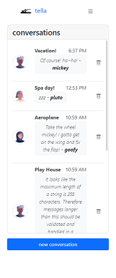
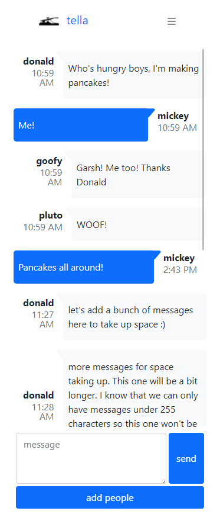
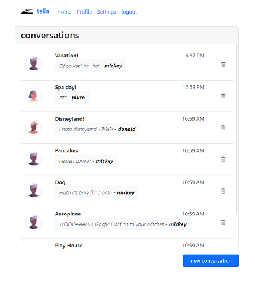
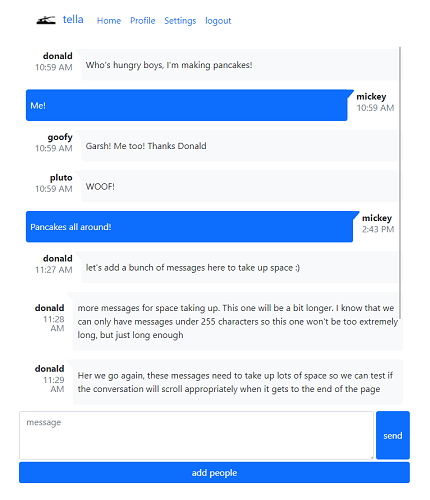

# Tella Messaging App

## _Description_
A privacy-based messaging app built with a MySQL database using Model View Controller (MVC) paradigm to focus on connecting with those you love.

## _Visual_

Live Application: [Tella Messageing App](https://tella.herokuapp.com/)









## _Built with_

- [x] Express-handlebars
- [x] Model-View-Controller paradigm
- [x] MySQL2
- [x] Sequelize

## _Installation_

See [installation.md](./installation.md) for instructions on setting up this project.
## _References_

UC Berkeley Extension Coding Bootcamp - Module 14: Model-View-Controller (MVC)

## _Contributors_

* [x] [Scott Rohrig](https://github.com/scottrohrig)
* [x] [Tri Nguyen](https://github.com/tringuyen1086)
* [x] [Mariko Kaku](https://github.com/marikokaku)
* [x] [Darrell Markham](https://github.com/DarrellMarkham)
* [x] [Jeffrey Jing](https://github.com/JeffreyJing)

### _User Story_
```
AS An End-User
I WANT to be able to login to view and send messages as well as add a specific contact to my Messaging App.
SO THAT I communicate with my friend list as well as block the unwanted messages from specific users.
```
### _Acceptance Criteria_
```
GIVEN a messaging website
THEN I am presented with a login screen
WHEN I enter my login credentials and submit
THEN I am sent to the home page with a list of my conversations
WHEN I choose to create a new conversation
THEN I am prompted to enter the conversation title and upon submitting, the conversation is added to my list of conversations.
WHEN I select a conversation to view
THEN I am presented with the given messages of that conversation.
WHEN I choose to Send a message
THEN a message is added to the conversation with the user’s name, message text and timestamp.
WHEN I choose to Add a new contact
THEN I am presented with a prompt to add First Name, Last Name, and Email of the new contact.
WHEN I submit the new contact details
THEN that contact is validated to make sure it exists in the database, and if so, added to my contacts
WHEN I choose to Delete a message
THEN I am prompted to confirm deletion

```
